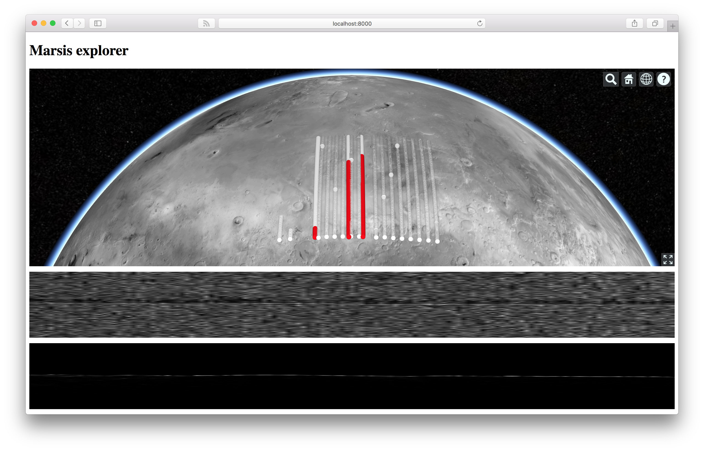

Marsis explorer
===============

A 2016 NASA SpaceApps Challenge entry for the local South Australian challenge: [Marvel](https://github.com/SpaceAppsAdl/SouthAustraliaChallenge2016#mars-australian-remote-virtual-experiment-laboratory).

This entry looks at the subsurface data provided by the [Mars Express Orbiter](https://en.wikipedia.org/wiki/Mars_Express) which was sent to examine Mars for possible water and ice below the planet's surface.

The main objective of the app is to display each radar echo data on a map of Mars, which can then be clicked to display both that and the simulation data to try and filter out false positives.

See progress at:
[marsis-explorer.herokuapp.com](http://marsis-explorer.herokuapp.com)



## To run it yourself

* Clone this project.
* Start up a python simpleserver by typing this command into your Terminal:
* ```$ python -m SimpleHTTPServer 8000```
* Visit ```http://localhost:8000``` in your favourite browser.

## Matlab data

* Damien did lots of work to massage the Matlab data into GeoJSON for mapping.
* See the '[Parsers](https://github.com/33d/marsis-explorer/tree/master/parsers)' directory for the [Octave](https://www.gnu.org/software/octave/) exporters Damien wrote.
* Here is the original [Matlab data](https://github.com/SpaceAppsAdl/SouthAustraliaChallenge2016/tree/master/MatlabCode)

## Features to add

* Ability to save back possible water/ice detected points back to a database so that they can be exported for NASA to further explore.
* Ability for the general public to setup an account to work on the data.

----

Built by Damien & Simon 23rd/24th April 2016.